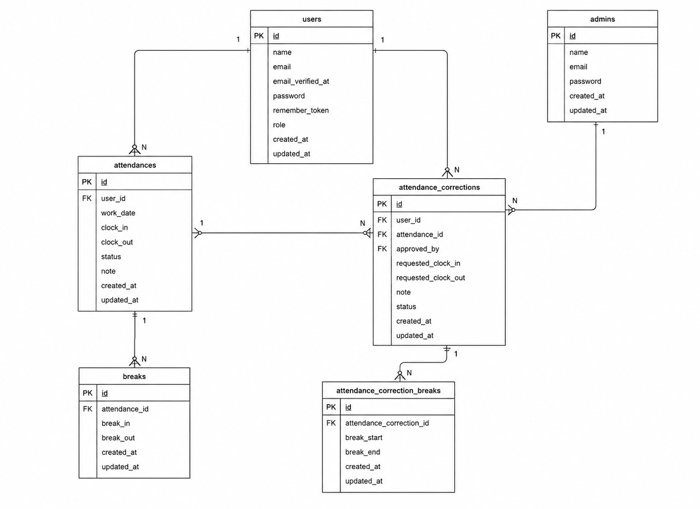

# アプリケーション
勤怠管理アプリ

本アプリケーションは、Laravelを用いて開発した勤怠管理システムです。<br>
Laravel Fortifyによる認証機能を実装し、一般ユーザー向けの打刻・勤怠管理機能と、管理者向けの勤怠管理・申請承認機能を提供しています。
<br>
出勤・退勤・休憩打刻、勤怠修正申請、月次勤怠一覧、CSV出力、メール認証機能など、実務を想定した機能を実装しています。

## 環境構築

### 1. Docker ビルド
・git clone git@github.com:tsumika0524/attendances.git<br>
・docker-compose up -d --build<br>

## 環境構築

### Dockerコンテナ起動

```bash<br>
docker-compose up -d<br>
```<br>

### PHPコンテナへ接続<br>

```bash
docker exec -it attendances bash
```

### Laravel初期設定

```bash
cd src

composer install
cp .env.example .env
php artisan key:generate
```

### データベース設定・マイグレーション

```bash
php artisan migrate
php artisan db:seed
```

### フロントエンド環境構築

```bash
npm install
npm run dev
```

### 動作確認

ブラウザで以下にアクセス

```txt
http://localhost
```

以下が表示されれば環境構築成功です。

- Laravelトップページ
- ログイン画面
- 勤怠管理画面

#### 環境開発URL
・商品一覧：http://localhost<br>
・マイリスト：http://localhost/?tab=mylist<br>
・ログイン:http://localhost/login<br>
・商品詳細: http://localhost/item/{item_id}<br>
・商品購入：http://localhost/purchase/{item_id}<br>
・住所変更：http://localhost/purchase/address/{item_id}<br>
・商品出品：http://localhost/sell<br>
・プロフィール：http://localhost/purchase/mypage<br>
・プロフィール編集：http://localhost/mypage/profile<br>
・購入商品一覧：http://localhost/mypage?page=buy<br>
・出品商品一覧：http://localhost/mypage?page=sell<br>


##### 使用技術(実行環境)
・PHP 8.4.13<br>
・Laravel 8.83.29<br>
・MySQL 8.0.26 <br>
・nginx 1.21.1 <br>
・jquery 3.7.1.min.js<br>
・Docker / Docker Compose<br>
・Laravel Fortify（認証）<br>
・Mailhog（メール認証）<br>
・PHPUnit（テスト）<br>

######　ER図
